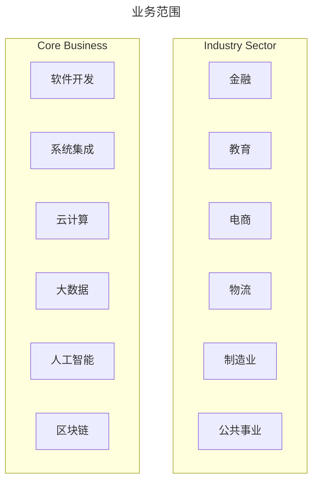

# 成都长享科技有限公司

## 关于我们

::: info 关于我们

成都长享科技有限公司是一家专注于技术服务的公司，致力于为客户提供高质量的软件定制开发、系统集成、云计算、大数据、人工智能、区块链等技术服务。公司创始团队拥有丰富的技术行业经验和管理经验，为客户提供专业的技术解决方案和优质的服务。

作为一家技术服务公司，成都长享科技有限公司注重技术的创新和研发，不断引进和应用最新的技术和工具，以确保客户的项目能够保持领先并具有竞争力。
:::

## 核心价值观

::: info 核心价值观

公司的核心价值观是客户至上、质量第一、创新引领、协同共享，公司始终坚持以客户需求为导向，为客户提供高效、可靠、优质的技术服务。

:::

## 主营业务

::: info 主营业务

成都长享科技有限公司的主营业务包括软件开发、系统集成、云计算、大数据、人工智能、区块链等技术服务。公司业务遍及多个行业领域，如金融、医疗、教育、电商、物流等，积累了丰富的行业经验和案例。

公司拥有完善的服务体系和质量管理体系，为客户提供全方位、一站式的技术服务。
:::

## 公司的愿景

::: info 愿景

成都长享科技有限公司的愿景是成为一家领先的技术服务公司，帮助客户实现数字化转型和升级，共同创造更美好的未来。

:::

## 联系我们

- 中国（四川）自由贸易试验区成都高新区锦蜀街37号4栋1单元2层203号